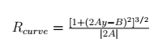

# Advanced Lane Finding Project

The goals / steps of this project are the following:

* Compute the camera calibration matrix and distortion coefficients given a set of chessboard images.

* Apply a distortion correction to raw images.

* Use color transforms, gradients, etc., to create a thresholded binary image.

* Apply a perspective transform to rectify binary image ("birds-eye view").

* Detect lane pixels and fit to find the lane boundary.

* Determine the curvature of the lane and vehicle position with respect to center.

* Warp the detected lane boundaries back onto the original image.

* Output visual display of the lane boundaries and numerical estimation of lane curvature and vehicle position.

[//]: # (Image References)

[image1]: ./pics/undistort.png "Undistorted"
[image2]: ./pics/undistort_test4.png "Road Transformed"
[image3]: ./pics/filter_tune.png "Binary Example"
[image4]: ./pics/warped.png "Warp Example"
[image5]: ./pics/color_fit_lines.jpg "Fit Visual"
[image6]: ./pics/lane.png "Output"
[video1]: ./pics/project_video.mp4 "Video"

---

### Camera Calibration

#### 1. Briefly state how you computed the camera matrix and distortion coefficients. Provide an example of a distortion corrected calibration image.

The code for this step is contained in the first and second code cell of the IPython notebook `P4.ipynb`.

I start by preparing "object points", which will be the (x, y, z) coordinates of the chessboard corners in the world. Here I am assuming the chessboard is fixed on the (x, y) plane at z=0, such that the object points are the same for each calibration image. Thus, `objp` is just a replicated array of coordinates, and `objpoints` will be appended with a copy of it every time I successfully detect all chessboard corners in a test image. `imgpoints` will be appended with the (x, y) pixel position of each of the corners in the image plane with each successful chessboard detection. For 3 of the calibration images (#1, #4 and #5) `cv2.findChessboardCorners` was not able to detect all chessboard corners because the image is cropped and thus some corners are outside of the image.

I then used the output `objpoints` and `imgpoints` to compute the camera calibration and distortion coefficients using the `cv2.calibrateCamera()` function. I applied this distortion correction to the test image using the `cv2.undistort()` function and obtained this result:

![Undistorted][image1]

### Pipeline (single images)

#### 1. Provide an example of a distortion-corrected image.

To demonstrate this step, I will describe how I apply the distortion correction to one of the test images like this one:

![Road Transformed][image2]

#### 2. Describe how (and identify where in your code) you used color transforms, gradients or other methods to create a thresholded binary image.  Provide an example of a binary image result.

I used a combination of color and gradient thresholds to generate a binary image (thresholding steps in cells 4 through 7 in `P4.ipynb`). Here's an example of my output for this step.

![Binary Example][image3]

#### 3. Describe how (and identify where in your code) you performed a perspective transform and provide an example of a transformed image.

The code for my perspective transform includes a function called `warp()`, which appears in 9th code cell of the IPython notebook. The `warp()` function takes as inputs an image (`img`). The transformation matrix `M` is calculated based on the source (`src`) and destination (`dst`) points. I chose the hardcode the source and destination points in the following manner:

```python
src_verts = np.float32(
    [[(img_size[0] / 2) - 54, img_size[1] / 2 + 95],
    [((img_size[0] / 6) - 10), img_size[1]],
    [(img_size[0] * 5 / 6) + 60, img_size[1]],
    [(img_size[0] / 2 + 59), img_size[1] / 2 + 95]])
dst_verts = np.float32(
    [[(img_size[0] / 4), 0],
    [(img_size[0] / 4), img_size[1]],
    [(img_size[0] * 3 / 4), img_size[1]],
    [(img_size[0] * 3 / 4), 0]])
```

This resulted in the following source and destination points:

| Source        | Destination   |
|:-------------:|:-------------:|
| 586, 455      | 320, 0        |
| 203, 720      | 320, 720      |
| 1127, 720     | 960, 720      |
| 699, 455      | 960, 0        |

I verified that my perspective transform was working as expected by drawing the `src` and `dst` points onto a test image and its warped counterpart to verify that the lines appear parallel in the warped image.

![Warp Example][image4]

#### 4. Describe how (and identify where in your code) you identified lane-line pixels and fit their positions with a polynomial?

In the 10th and 11th code cell I identified the lane-line pixels using a sliding window. I also tested the method with the convolution in cell 12. Then I fit my lane lines with a 2nd order polynomial like this:

![Fit Visual][image5]

#### 5. Describe how (and identify where in your code) you calculated the radius of curvature of the lane and the position of the vehicle with respect to center.

In the 13th and 14th code cell I calculated the radius of the curvature of the lane in accordance with the following formula:



I also did the conversion to meters. For this I used the following formulae to get the corresponding coefficients:


#### 6. Provide an example image of your result plotted back down onto the road such that the lane area is identified clearly.

I implemented this step in code cell 15 in the function `plot_lane()`. At the top of the next page is an example of my result on a test image.

In code cell 16 I created a pipeline to combine all the previous steps.

In code cell 17 I created a class `Line()` to hold the data and methods for line detection.

![Output][image6]

---

### Pipeline (video)

#### 1. Provide a link to your final video output.  Your pipeline should perform reasonably well on the entire project video (wobbly lines are ok but no catastrophic failures that would cause the car to drive off the road!).

Here's a [link to my video result](./pics/project_video.mp4)

---

### Discussion

#### 1. Briefly discuss any problems / issues you faced in your implementation of this project.  Where will your pipeline likely fail?  What could you do to make it more robust?

Here I'll talk about the approach I took, what techniques I used, what worked and why, where the pipeline might fail and how I might improve it if I were going to pursue this project further.

First I tweaked the parameters for the sobel and color threshold to get as much of the lane lines (yellow and white and also in areas with shadow) but without much distracting noise. Next I searched for the best source points for the perspective transform to get parallel lines. The result was kind of a trade-off, as some points worked perfect for some images but not so good on others. Eventually, I think I got a good set of source points.

For the video I created a Line class which handles the processing of an image stream and the bookkeeping of previous results. This is convenient for later comparison of results and easier detection of the lane based on a priori knowledge.

I experimented with the number of lane fits from previous images to be used in the best fit. The best results I got with 5 previous fits in combination with correction for the center point of each fit.

For the right lane I got wobbly results due to the gaps between the dashes. I tried to keep some lane pixels of the previous images but it made the fit worse. Neither copying some lane pixels from left to right did bring better results. Another possibility is to copy the points from below but this would result in a stepped line. The best way might be to interpolate between the line segments.

For the sanity check I compared the current fitting coefficients with the best fit of the last image. But the values showed big changes while the current fit looked still fine. On the other hand, bad results have not always been reflected by big changes in the coefficients.

I got the best results for the sanity check using the lane width. If the values are out of a reasonable range the cache of the previous results is cleared and the lane detection starts from scratch.

For the more challenging videos I think it will be necessary to use ROIs to prevent the detection algorithm from interpreting the wrong features as lane lines. Especially, in areas with shadows the current version of the algorithm is easily confused by the noise. Morphological transformations like opening or closing might also improve the results and make the detection more robust.
